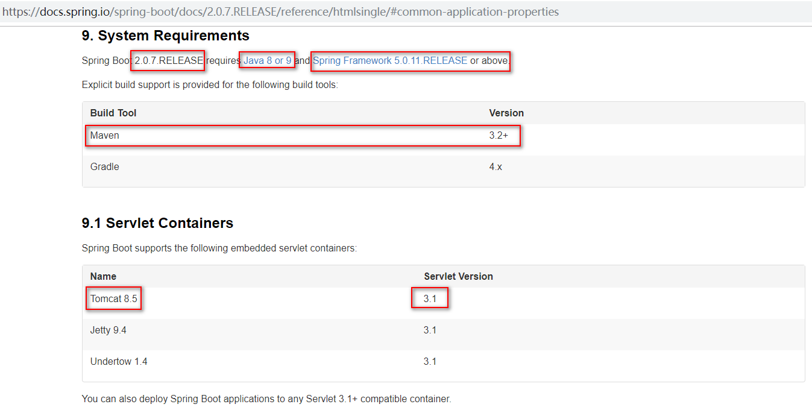
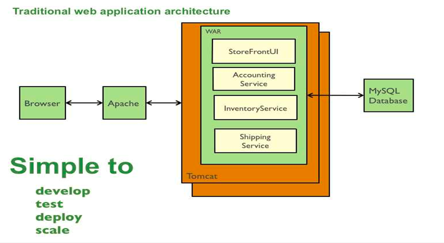
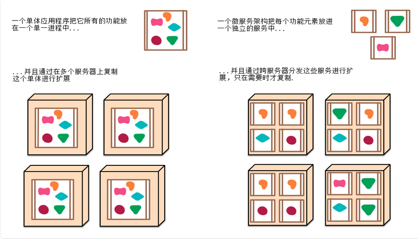
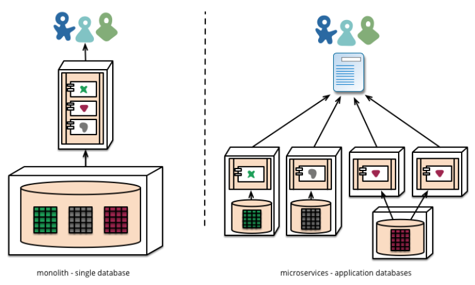
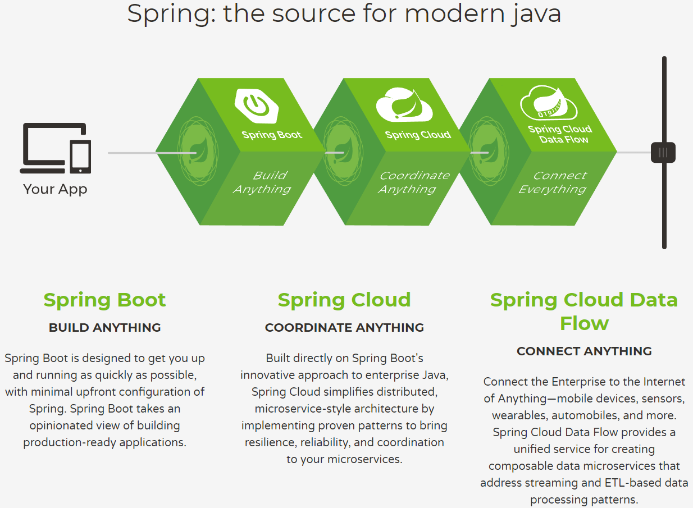
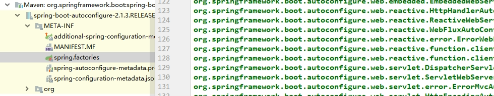
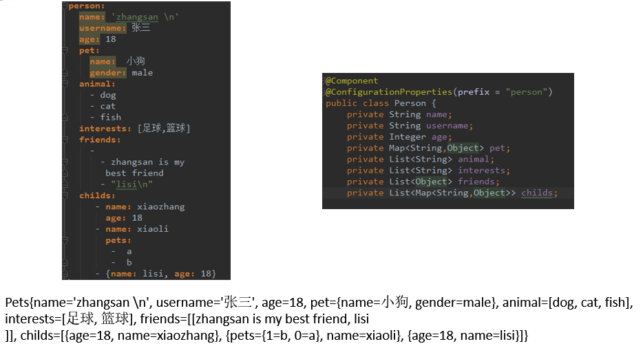
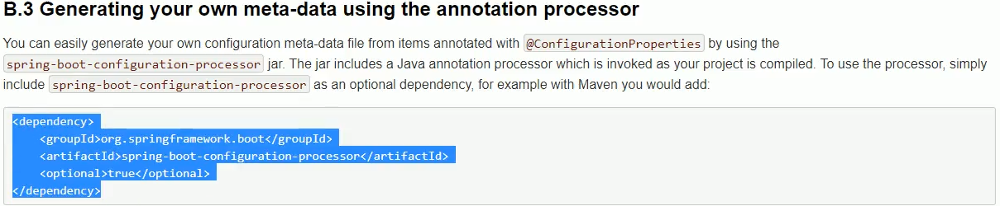
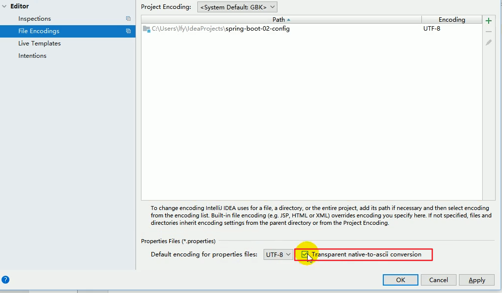

sprngboot是要结合着微服务用的。之前我们的项目是单体应用，所有的功能最后都在一个war包中，会造成其中一个功能一旦出了问题，那么服务器就可以卡死，进而该服务器上的所有功能都会崩溃。这就是单体应用很明显的劣势。所以我们可以把单体应用中的每个功能都作为一个独立的应用来开发，结合着springboot自带tomcat的便利，把这些应用分布式地部署在不同的服务器上。

# Spring Boot 介绍

## 概述

Spring Boot是由Pivotal团队提供的全新框架，其设计目的是用来简化新Spring应用的初始搭建以及开发过程。习惯优于配置

## 1.2 为什么使用Spring Boot 

J2EE笨重的开发、繁多的配置、低下的开发效率、复杂的部署流程、第三方技术集成难度大。

\> **其实就是三大框架的整合太麻烦**

## 1.3 Spring Boot是什么

一站式整合所有应用框架的框架；并且完美整合Spring技术栈； https://spring.io/projects 

Spring Boot会简化Spring应用的开发，**约定大于配置**，去繁从简，just run就能创建一个独立的，产品级别的应用

## 1.4 Spring boot 优点

l  快速创建独立运行的Spring项目以及与主流框架集成

l  使用嵌入式的Servlet容器，应用无需打成WAR包（自带精简的tomcat）

l  starters自动依赖与版本控制

l  大量的自动配置，简化开发，也可修改默认值

l  无需配置XML，无代码生成，开箱即用

l  准生产环境的运行时应用监控

l  与云计算的天然集成

## 1.5 环境要求

https://docs.spring.io/spring-boot/docs/2.0.7.RELEASE/reference/htmlsingle/#getting-started-system-requirements



# 第二章 项目架构-单体应用

## 2.1 单体应用



开发简单：自己一个人就可以开发

测试简单：不涉及多个服务器的联调

部署简单：打成war包放到服务器中就行

扩展简单：每个服务器都放一套一样的代码即可


## 2.2 单体应用（monolith application）

l  就是将应用程序的所有功能都打包成一个独立的单元，可以是 JAR、WAR、EAR 或其它归档格式。

l  package -Dmaven.test.skip=true（跳过测试）

## 2.3 单体应用有如下优点：

l  **为人所熟知**：现有的大部分工具、应用服务器、框架和脚本都是这种应用程序；

l  **IDE友好**：像 NetBeans、Eclipse、IntelliJ 这些开发环境都是针对开发、部署、调试这样的单个应用而设计的；

l  **便于共享**：单个归档文件包含所有功能，便于在团队之间以及不同的部署阶段之间共享；

l  **易于测试**：单体应用一旦部署，所有的服务或特性就都可以使用了，这简化了测试过程，因为没有额外的依赖，每项测试都可以在部署完成后立刻开始；

l  **容易部署**：只需将单个归档文件复制到单个目录下。

 

## 2.4 单体应用的一些不足：

l  **不够灵活**：对应用程序做任何细微的修改都需要将整个应用程序重新构建、重新部署。开发人员需要等到整个应用程序部署完成后才能看到变化。如果多个开发人员共同开发一个应用程序，那么还要等待其他开发人员完成了各自的开发。这降低了团队的灵活性和功能交付频率；

l  **妨碍持续交付**：单体应用可能会比较大，构建和部署时间也相应地比较长，不利于频繁部署，阻碍持续交付。在移动应用开发中，这个问题会显得尤为严重；

l  **受技术栈限制**：对于这类应用，技术是在开发之前经过慎重评估后选定的，每个团队成员都必须使用相同的开发语言、持久化存储及消息系统，而且要使用类似的工具，无法根据具体的场景做出其它选择；

l  **技术债务**：“不坏不修（Not broken，don’t fix）”，这在软件开发中非常常见，单体应用尤其如此。系统设计或写好的代码难以修改，因为应用程序的其它部分可能会以意料之外的方式使用它。随着时间推移、人员更迭，这必然会增加应用程序的技术债务。 

# 第三章 项目架构-微服务

## 3.1 微服务



## 3.2 微服务的样子

https://www.martinfowler.com/articles/microservices.html 微服务microservices

http://blog.cuicc.com/blog/2015/07/22/microservices/

> 【RPC（远程过程调用）】：
> 1、dubbo【传输数据没用HTTP协 议；dubbo协议组装数据】/zookpeer
> 2、SpringCloud：HTTP+JSON
> In short（简言之）, the microservice architectural style 【架构风格】[1] is an approach to developing a single application as a suite of small services【独立应用变成一套小服务】, each running in its own process and communicating with lightweight(轻量级沟通) mechanisms(每一个都运行在自己的进程内（容器）), often an HTTP resource API(用HTTP，将功能写成能接受请求). These services are built around business capabilities （独立业务能力）and independently deployable by fully automated deployment machinery（应该自动化独立部署）. There is a bare minimum of centralized management of these services（应该有一个能管理这些服务的中心）, which may be written in different programming languages (独立开发语言)and use different data storage technologies（独立的数据存储）.





下图中每个小点都是一个功能，涉及到两个问题

1，怎么快速开发出这些功能（总不能没开发一个功能都要进行框架的整合）

2，功能直间怎么互相调用（RPC）


## 3.3 Spring官网

springboot：开发

springcloud：部署

springclouddataflow：数据连接



# HelloWorld

发送/hello 请求，服务器响应 "OK" 字符串; 

### 创建maven工程

##### 引入如下依赖

```xml
<!-- Inherit defaults from Spring Boot -->
<!-- 所有的SpringBoot应用都必须依赖一个父项目 -->
  <parent>
   <groupId>org.springframework.boot</groupId>
   <artifactId>spring-boot-starter-parent</artifactId>
   <version>2.1.3.RELEASE</version>
  </parent>


<!-- Add typical dependencies for a web application -->
<!--开发web应用，需要导入web开发的场景的依赖-->
  <dependencies>
<!--
导入了开发web应用的功能（场景）
会有超级多的xxx-starter:场景启动器，我们要写什么功能就可以导入这场景启动器，启动器会把所有的jar包都导进来。jar也不用管版本，spring-boot-dependencies(版本仲裁中心有所有的依赖的版本)中都已经定义好了
-->
   <dependency>
     <groupId>org.springframework.boot</groupId>
     <artifactId>spring-boot-starter-web</artifactId>
   </dependency>
  </dependencies>
```

##### 增加控制器

```
@Controller
	public class HelloController {
		@ResponseBody
		@GetMapping("/hello")
		public String handle01(){
		return "OK!+哈哈";
	}
}
```

##### 编写主程序

```java
   /**
   
    1、标了这个@SpringBootApplication的类（必须有main方法） 说明这是一个SpringBoot应用【主配置类，主程序类】
    
    2、默认的约定：
    所有的组件都必须在@SpringBootApplication所在包或者下面的子包，才能被自动扫描到。
    可以使用@ComponentScan(basePackages = "com.atguigu")注解指定包扫描路径。
    
    如果我们想要改掉SpringBoot的一些默认配置。就在maven的resource文件夹下下面创建一个配置文件application.properties
    访问端口号：server.port=8888
    启动显示的图片：spring.banner.image.location=classpath:bug.jpg
    访问路径：server.servlet.context-path=/spring-boot-helloworld
    
    简单原理：
    1）、SpringBoot已经适配了所有的场景，我们相用引入这个场景的starter即可，剩下都是自动配置好的
    2）、我们只需要写controller\service
    3）、嵌入式的tomcat
    2、简化部署
    1）、引入springboot插件
    2）、将应用打包
    3）、直接双击或者使用java -jar 命令运行 ;里面已经有嵌入式的tomcat
   */
     @SpringBootApplication
     public class MainApplication {
    	 public static void main(String[] args) {
     	//Spring应用跑起来
    	 SpringApplication.run(MainApplication.class, args);
     	}
     }
```

##### 运行访问

http://localhost:8080/hello


# 使用插件的方式打包

### 在pom文件中引入springboot插件

```xml
<!-- 引入springboot插件；打包插件 -->
<build>
    <plugins>
       <plugin>
            <groupId>org.springframework.boot</groupId>
            <artifactId>spring-boot-maven-plugin</artifactId>
        </plugin>
    </plugins>
</build> 
```

### 将应用打包

运行maven命令：package。使用插件和不使用插件打成的jar包是有区别的

### 运行

直接双击或者使用java -jar xxx.jar 命令运行，里面已经有嵌入式的tomcat。然后就可以访问了


Q：SpringMVC等这些我们没有导过怎么进来的，没有Tomcat为什么也可以访问
A：场景启动器负责导包，SpringBoot负责管理jar的版本。在启动器中已经把tomcat的jar包导入进来了。


【自动配置】：springboot有自动配置；
          @SpringBootApplication
                      @SpringBootConfiguration:这是一个@Configuratio配置类
                      @EnableAutoConfiguration:开启自动配置功能
                      @ComponentScan:自定义默认的包扫描

​          @AutoConfigurationPackage:给容器中导入组件 @Import
​          @Import(AutoConfigurationImportSelector.class)
​          public @interface EnableAutoConfiguration {
​          //自动配置获职这些自动配置类；META-INF/spring.factories
​          所有能自动配置的都在 spring-boot-autoconfigure-2.1.3.RELEASE.jar

xxxxAutoConfiguration类是来自动配置的；



SpringBoot的一个缺点；不能写jsp；内嵌的tomcat不支持jsp；前后分离；
      前端给我们微服务发请求，我们不负责页面。只负责返回json数据：


然后我们用springboot开发一个项目。我们可以在spring的官网找到相应的starter的pom配置

路径：spring.io-->projects-->springboot-->learn-->选择一个版本，点击reference doc-->点击starter标题。就可以看到了

当然，我们不用这么麻烦，不论是idea还是eclipse，都有一个spring initializer的选项可以直接把相应的配置直接生成。


# SpringBoot-yml配置文件

### 配置文件

- SpringBoot使用一个全局的配置文件，配置文件名是固定的：application.properties和application.yml

- - 配置文件的作用：修改SpringBoot自动配置的默认值；SpringBoot在底层都给我们自动配置好；
  - YAML（YAML Ain't Markup Language）
  - YAML A Markup Language：是一个标记语言
  - YAML isn't Markup Language：不是一个标记语言；

- YAML也是标记语言。以前的配置文件；大多都使用的是 xxxx.xml文件。YAML以数据为中心，比json、xml等更适合做配置文件

- 例如

  ```
  server:
    port:8888
    servlet:
        context-path:/spring-boot-helloworld
        
  atguigu:
    aaa:
          aa:
          bb:
          cc:
    bbb:
    ccc:
  ```


### YAML语法

##### YAML基本语法

- ​    使用缩进表示层级关系

- ​    **缩进时不允许使用Tab键，只允许使用空格**

- ​    缩进的空格数目不重要，只要相同层级的元素左侧对齐即可

- ​    大小写敏感


##### YAML 支持的三种数据结构

​    对象：键值对的集合

​    数组：一组按次序排列的值

​    字面量：单个的、不可再分的值

### 值的写法

##### 字面量：普通的值（数字，字符串，布尔）

​    k: v     字面直接来写；

​    字符串默认不用加上单引号或者双引号；

​    双引号：不会转义字符串里面的特殊字符；特殊字符会作为本身想表示的意思，例如：

​		name: "zhangsan \n lisi"：输出；zhangsan 换行 lisi

​    单引号：会转义特殊字符，特殊字符最终只是一个普通的字符串数据，例如：

​        name: 'zhangsan \n lisi'：输出；zhangsan \n lisi

##### 对象、Map（属性和值）（键值对）：

​    k: v     在下一行来写对象的属性和值的关系；注意缩进

​    对象还是k: v的方式

   

```
 friends:
	lastName: zhangsan
	age: 20
```

​    行内写法：

```
    friends: {lastName: zhangsan,age: 18}
```


##### 数组（List、Set）

用`- 值`表示数组中的一个元素

```
pets:
	‐ cat
	‐ dog
	‐ pig
```

行内写法

```
pets: [cat,dog,pig]
```




### yaml配置文件值获取

Dog类

```
public class Dog {
    private String name;
    private Integer age;

    @Override
    public String toString() {
        return "Dog{" +
                "name='" + name + '\'' +
                ", age=" + age +
                '}';
    }
    
    public String getName() {
        return name;
    }
    
    public void setName(String name) {
        this.name = name;
    }
    
    public Integer getAge() {
        return age;
    }
    
    public void setAge(Integer age) {
        this.age = age;
    }
}
```


Person类
```java
/*将配置文件中配置的每一个属性值，映射到这个组件中
@ConfiqurationProperties:告诉SpringBoot将本类中的所有属性和配置文件中相关的配置进行绑定：
 prefix ="person":指定映射配置文件中哪个标题下面的属性
只有这个组件是容器中的组件，才能容器提供的@ConfigurationProperties功能；所以要加上@Component注解
*/

import java.util.Date;
import java.util.List;
import java.util.Map;

@Component
@ConfigurationProperties(prefix = "person")
public class Person {
    private String lastName;
    private Integer age;
    private Boolean boss;
    private Date birth;
    private Map<String,Objct> maps;
    private List<Object> lists;
    private Dog dog;

    public String getLastName() {
        return lastName;
    }

    public void setLastName(String lastName) {
        this.lastName = lastName;
    }

    public Integer getAge() {
        return age;
    }

    public void setAge(Integer age) {
        this.age = age;
    }

    public Boolean getBoss() {
        return boss;
    }

    public void setBoss(Boolean boss) {
        this.boss = boss;
    }

    public Date getBirth() {
        return birth;
    }

    public void setBirth(Date birth) {
        this.birth = birth;
    }

    public Map<String, Objct> getMaps() {
        return maps;
    }

    public void setMaps(Map<String, Objct> maps) {
        this.maps = maps;
    }

    public List<Object> getLists() {
        return lists;
    }

    public void setLists(List<Object> lists) {
        this.lists = lists;
    }

    public Dog getDog() {
        return dog;
    }

    @Override
    public String toString() {
        return "Person{" +
                "lastName='" + lastName + '\'' +
                ", age=" + age +
                ", boss=" + boss +
                ", birth=" + birth +
                ", maps=" + maps +
                ", lists=" + lists +
                ", dog=" + dog +
                '}';
    }

    public void setDog(Dog dog) {
        this.dog = dog;
    }
}
```


yaml配置文件
```yaml
server:
	port:8081
person:
    lastName: zhangsan
	age: 18
    boss: false
    birth: 2017/12/12
    maps: {k1:v1,k2:12}
	lists:
        - lisi
        - zhaoliu
    dog:
        name:小狗
        age:2
```

Person类上会出现下面的提示，意思是要导入配置文件处理器

​                    

点击右面的open doc按钮，会出现以下界面，把下面这个界面的配置复制到pom.xml文件中。然后按照提示重启springboot，再次写yaml就会有提示了



```
<!--导入配置文件处理器，配置文件进行绑定就会有提示-->
<dependency>
    <groupId>org.springframework.boot</groupId>
    <artifactId>spring-boot-configuration-processor</artifactId>
    <optional>true</optional>
</dependency>
```


```java
/**
	SpringBoot单元测试；
	可以在测试期间很方便的类似编码一样进行自动注入等容器的功能
*/
@Runwith(SpringRunner.class)
@SpringBootTest
public class SpringBoote02ConfigApplicationTests {
	@Aoutowired
	Person person;
	
    @Test
    public void contextLoads(){
		System.out.println(person)；
	}

}
```

用properties的方式，看是否还能绑定值。

```properties
person.last-name=张三
person.age=18
person.birth=2017/12/15
person.boss=false
person.maps.k1=v1
person.maps.k2=14
person.lists=a,b,c
person.dog.name=dog
person.dog.age=15
```

再次运行测试类，证明还是可以获取到，但是中文会有乱码，此时要在idea中进行以下的设置。原因老师说，properties文件默认是ascii编码的方式，但是我们的idea已经设置过是用utf-8的方式进行编码的。




```java
//要在容器中才可以
@Component
public class Hello {
	//@Value不支持高级对象取值，yaml的高级写法不支持
	@Value("${haha.name}")
	private String name;

	@Value("${haha.age}")
	private Integer age;

	@Value("${haha.admin}")
	private boolean admin;

	@Value("${haha.interets}")
	private List<String> interets;

	//@Value("${haha.xiaoHello}")
	//private Hello xiaoHello = new Helto();
	//@Value("$(haha.content}")
	private Map<String,Object> content = new HashMap<>()；
```


```
haha.name=zhangsan
haha.age=18
haha.admin=true
haha.interets=basketball,zhangsan,hahaa

haha.xiaoHello,name=xiaohello
haha.xiaoHello.age=19
haha.content.msg=你好
haha.content.code=1
```

@Value(""):取出配置文件中非复杂对象的值
@ConfigurationProperties(”")：直接将配置文件中所有以某个xx开头和javaBean的属性一一绑定

如果想把配置文件单独写一份和对应的类绑定，可以用以下这个注解

@PropertySource(value ="classpath:hello.properties"):指定属性配置文件位置。
只支持properties，和springxml

SpringBoot:快速地把任何javaBean的任何属性都变为可配置的属性（就是说类中的属性值可以直接在配置文件中修改）；

