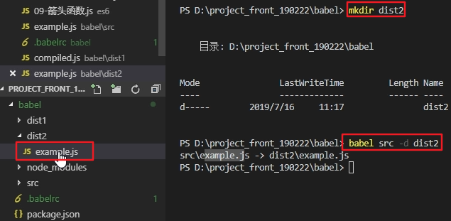

# 简介 

ES6的某些高级语法在浏览器环境甚至是Node.js环境中无法执行。

Babel是一个广泛使用的转码器，可以将ES6代码转为ES5代码，从而在现有环境执行执行。

这意味着，你可以现在就用 ES6 编写程序，而不用担心现有环境是否支持。

# 安装命令行转码工具

Babel提供babel-cli工具，用于命令行转码。它的安装命令如下：

```
npm install --global babel-cli
```

#查看是否安装成功

```
babel --version
```

# Babel的使用

### 1、初始化项目

创建babel文件夹

```
npm init -y
```

### 2、创建文件

src/example.js（在babel目录下创建src目录，然后再创建example.js文件）
下面是一段ES6代码：

```js
// 转码前
// 定义数据
let input = [1, 2, 3]
// 将数组的每个元素 +1
input = input.map(item => item + 1)
console.log(input)
```

### 3、配置.babelrc

Babel的配置文件是.babelrc，存放在项目（babel文件夹）的根目录下，该文件用来设置转码规则和插件，基本格式如下。

```js
{
    "presets": [],
    "plugins": []
}
```

presets字段设定转码规则，将es2015规则加入 .babelrc：

```js
{
    "presets": ["es2015"],//根据编写的级别，来设置不同的转码器
    "plugins": []
}
```

### 4、安装转码器

在项目中安装，执行以下命令

```
npm install --save-dev babel-preset-es2015
```

### 5、转码

```
# 转码结果写入一个文件
mkdir dist1
# --out-file 或 -o 参数指定输出文件
babel src/example.js --out-file dist1/compiled.js
# 或者
babel src/example.js -o dist1/compiled.js

# 整个目录转码
mkdir dist2
# --out-dir 或 -d 参数指定输出目录
babel src --out-dir dist2
# 或者
babel src -d dist2
```

babel .\src\example.js -o .\dist1\compiled.js

babel src -d dist2



### 5.1、转码的结果

```
"use strict";
//转码前
//定义数据
var input=[1,2,3]；
将数组的每个元素+1
input = input.map(function (item){
  return item +1;
})；
console.1og(input);
```


### 6、自定义脚本

改写package.json：

```json
{
    // ...
    "scripts": {
        // ...
        "build":  "babel src\\example.js -o dist\\compiled.js"
    },
}
```

### 转码的时候，执行下面的命令

```
mkdir dist
npm run build
```


