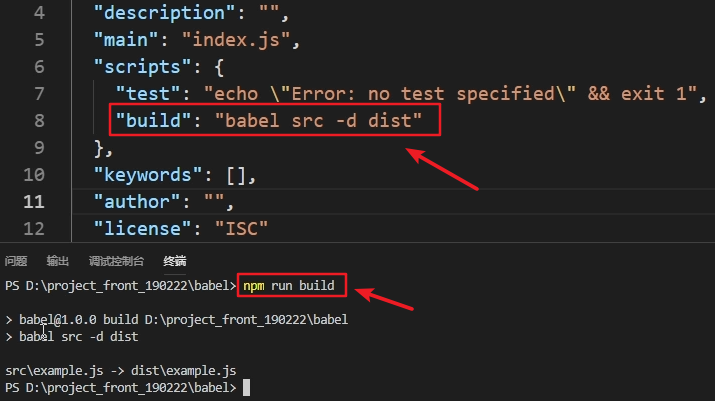

数据剪裁交给node.js，减少后端服务器，如tomcat的负担


浏览器的内核包括两部分核心：

- DOM渲染引擎；
- js解析器（js引擎）

js运行在浏览器内核中的js引擎内部，Node.js是脱离浏览器环境运行的JavaScript程序，基于V8 引擎


node.js的作用

(1)作为后端开发语言的替代，可以完成类似java、php等后端语言的功能

(2）部署高性能的分布式服务，例如可以使用Node.js做数据剪裁

(3)以上两种作用，都需要一些前端的工具，如前端npm包管理器、webpack项目打包工具、babel转码工具等。而这些工具都需要node这个运行环境。


安装完成之后可以用node -v来查看版本。

打开vscode工具，然后新建一个js文件，然后写上如下代码，在文件按目录运行node 文件名 即可运行。

```
var a= 10
var b=a+1
console.log(b)
```


**js编码规范参考**

> 无分号风格：https://standardjs.com/readme-zhcn.html
>
> 有分号风格（airbnb）：https://www.kancloud.cn/kancloud/javascript-style-guide/43119
>
> 
>
> **无分号的代码风格注意事项**
>
>  当一行代码是以：( 或者 [ 或者 `开头的时候，要在行首补上一个分号用避免一些语法解析错误。
>
> **因为js压缩之后，所有代码都变成一行了，可能会有歧义**
>
> 结论：
>
> 无论你的代码是否有分号，都建议如果一行代码是以 (、[、` 开头的，则最好都在其前面补上一个分号

```js
//引入http模块
const http= require('http')
http.createServer(function(request,response){
      //设置http响应头
      response.writeHead(200,{'Content-Type':'text/plain'})
      response.end('Hello Node.js Server')
}).listen(8888)

console.log('服务器已经启动成功，端口号是8888')
```

用浏览器访问localhost:8888即可

运行Node.js程序
（1)创建.js文件
（2）在命令行往中使用如下命令node文件名

npm会数着node一起安装。

nodejs--->node modules--->npm


# 使用npm管理项目

### 项目初始化

#建立一个空文件夹，在命令提示符进入该文件夹  执行命令初始化

```
npm init
```

#按照提示输入相关信息，如果是用默认值则直接回车即可。

#name: 项目名称

#version: 项目版本号

#description: 项目描述

#keywords: {Array}关键词，便于用户搜索到我们的项目

#最后会生成package.json文件，这个是包的配置文件，相当于maven的pom.xml

#我们之后也可以根据需要进行修改。

#如果想直接生成 package.json 文件，那么可以使用命令

```
npm init -y
```

初始化之后可以打开package.json文件，里面的内容就是我们输入的内容。以后，安装依赖的模块信息也会在这里显示。

```json
{
  "name": "node",
  "version": "1.0.0",
  "description": "",
  "main": "01-控制台程序.js",
  "scripts": {
    "test": "echo \"Error: no test specified\" && exit 1"
  },
  "keywords": [],
  "author": "",
  "license": "ISC"
}
```

其中，scripts里面可以写一些脚本的命令，然后用以下命令运行。如图。

```
npm run 名字
```




### 修改npm镜像

NPM官方的管理的包都是从 http://npmjs.com下载的，但是这个网站在国内速度很慢。
这里推荐使用淘宝 NPM 镜像 http://npm.taobao.org/ ，淘宝 NPM 镜像是一个完整 npmjs.com 镜像，同步频率目前为 10分钟一次，以保证尽量与官方服务同步。
设置镜像地址：
#经过下面的配置，以后所有的 npm install 都会经过淘宝的镜像地址下载

```
npm config set registry https://registry.npm.taobao.org 
```

#查看npm配置信息

```
npm config list
```


### npm包管理器

安装某个模块

```
npm install 模块名
```

比如，npm install jquery。就会把jquery相关的依赖模块下载到当前项目路径(node_modules)下。并且会在package.json文件中加上相关的信息，也就是说package.json维护了项目的模块依赖。

```
"dependencies": {
    "jquery": "^3.4.1"
}
```

并且会生成package-lock.json文件，里面描述了最开始安装jquery模块时，jqury的版本号是多少。以便之后恢复模块时，还能还原到当时的版本。

恢复模块：运行以下命令。根据dependencies节点中的配置初始化项目，并且将相关的依赖模块下载到当前项目路径(node_modules)下。

```
npm install
```

#如果安装时想指定特定的版本

```
npm install jquery@2.1.x
```

#devDependencies节点：开发时的依赖包，项目打包到生产环境的时候不包含的依赖

#使用 -D参数将依赖添加到devDependencies节点

```
npm install --save-dev eslint
#或
npm install -D eslint
```

运行之后，会在package.json文件中生成如下信息。

```
"devDependencies"：{
    "eslint": "^6.0.1"
}
```

#全局安装

#Node.js全局安装的npm包和工具的位置：用户目录\AppData\Roaming\npm\node_modules

#一些命令行工具常使用全局安装的方式

```
npm install -g webpack
```

**以下这几个命令不怎么用**

#更新包（更新到最新版本）

```
npm update 包名
```

#全局更新

```
npm update -g 包名
```

#卸载包

```
npm uninstall 包名
```

#全局卸载

```
npm uninstall -g 包名
```

