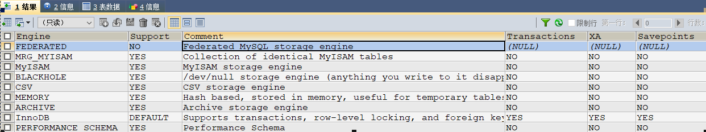

# Table of Contents

* [存储引擎](#存储引擎)
    * [Mysql逻辑架构介绍](#mysql逻辑架构介绍)
    * [用命令进行查看](#用命令进行查看)
    * [MyISAM和InnoDB](#myisam和innodb)
    * [阿里巴巴、淘宝用哪个](#阿里巴巴淘宝用哪个)
* [Join查询](#join查询)
    * [SQL执行顺序(一般情况下)](#sql执行顺序一般情况下)
        * [手写](#手写)
        * [机读](#机读)
        * [总结](#总结)
    * [Join图](#join图)
    * [实例](#实例)
    * [多表联查的本质](#多表联查的本质)
* [索引与数据处理](#索引与数据处理)
    * [是什么](#是什么)


# 存储引擎

### Mysql逻辑架构介绍

和其它数据库相比，MySQL有点与众不同，它的架构可以在多种不同场景中应用并发挥良好作用。主要体现在存储引擎的架构上，插件式的存储引擎架构将查询处理和其它的系统任务以及数据的存储提取相分离。这种架构可以根据业务的需求和实际需要选择合适的存储引擎。


1.连接层

最上层是一些客户端和连接服务，包含本地sock通信和大多数基于客户端/服务端工具实现的类似于tcp/ip的通信。主要完成一些类似于连接处理、授权认证、及相关的安全方案。在该层上引入了线程池的概念，为通过认证安全接入的客户端提供线程。同样在该层上可以实现基于SSL的安全链接。服务器也会为安全接入的每个客户端验证它所具有的操作权限。

2.服务层

第二层架构主要完成大多数的核心服务功能，如SQL接口，并完成缓存的查询，SQL的分析和优化及部分内置函数的执行。所有跨存储引擎的功能也在这一层实现，如过程、函数等。在该层，服务器会解析查询并创建相应的内部解析树，并对其完成相应的优化如确定查询表的顺序，是否利用索引等，最后生成相应的执行操作。如果是select语句，服务器还会查询内部的缓存。如果缓存空间足够大，这样在解决大量读操作的环境中能够很好的提升系统的性能。

SQL interface：各种查询语句或存储过程的最先进入的地方

Parser：对查询语句进行解析，有些注释要去掉

Optimizer：优化器，就是目前要学习的地方

Caches&Buffers：缓存

3.引擎层

 存储引擎层，存储引擎真正的负责了MySQL中数据的存储和提取，服务器通过API与存储引擎进行通信。不同的存储引擎具有的功能不同，这样我们可以根据自己的实际需要进行选取。后面介绍MyISAM和InnoDB

4.存储层

数据存储层，主要是将数据存储在运行于裸设备的文件系统之上，并完成与存储引擎的交互。


### 用命令进行查看

1，看mysql现在已提供什么存储引擎:

```
show engines;
```



查询结果中
Engine参数                  指存储引擎名称：
Support参数                说明MySOL是否支持该类型引擎：
Comment参数            表示对该引擎的评论；
Transaction参数         表示是否支持事务处理：
XA参数                         表示是否分布式交易处理的XA规范；
Savepoints参数          表示是否支持保存点，以方便事务的回滚操作

从图中也可以看到InnoDB支持事务，行级锁，和外键

2，看mysql当前默认的存储引擎:

```
  mysql> show variables like '%storage_engine%';
```


### MyISAM和InnoDB

现在最常用的存储引擎是InnoDB，它从MySQL 5.5.5版本开始成为了默认存储引擎。 

下表中前三点要能说出来

| 对比项     | MyISAM                                                       | InnoDB                                                       |
| ---------- | ------------------------------------------------------------ | ------------------------------------------------------------ |
| **主外键** | **不支持**                                                   | **支持**                                                     |
| **事务**   | **不支持**                                                   | **支持**                                                     |
| **行表锁** | **表锁，即使操作一条记录也会锁住整个表，不适合高并发的操作** | **行锁,操作时只锁某一行，不对其它行有影响，适合高并发的操作** |
| 缓存       | 只缓存索引，不缓存真实数据                                   | 不仅缓存索引还要缓存真实数据，对内存要求较高，而且内存大小对性能有决定性的影响 |
| 表空间     | 小                                                           | 大                                                           |
| 关注点     | 性能                                                         | 事务                                                         |
| 默认安装   | Y                                                            | Y                                                            |

### 阿里巴巴、淘宝用哪个


Percona 为 MySQL 数据库服务器进行了改进，在功能和性能上较 MySQL 有着很显著的提升。该版本提升了在高负载情况下的 InnoDB 的性能、为 DBA 提供一些非常有用的性能诊断工具；另外有更多的参数和命令来控制服务器行为。

该公司新建了一款存储引擎叫xtradb完全可以替代innodb,并且在性能和并发上做得更好,

阿里巴巴大部分mysql数据库是使用的在percona的原型加以修改的版本。
AliSql+AliRedis  TDDL HSF（dubbo的改良版）

# Join查询

### SQL执行顺序(一般情况下)

##### 手写

> SELECT DISTINCT
>
> ​        <select_list>
>
> FROM
>
> ​        <left_table><join_type> JOIN <right_table> ON <join_condition>
>
> WHERE
>
> ​        <where_condition>
>
> GROUP BY
>
> ​        <group by_list>
>
> HAVING
>
> ​        <having_condition>
>
> ORDER BY
>
> ​        <order_by_ condition>
>
> LIMIT <limit_number>


##### 机读

> FROM <left_table>
>
> ON <join_condition><join_type>  JOIN <right_table>
>
> WHERE <where_condition>
>
> GROUP BY <group_by_list>
>
> HAVING <having_condition>
>
> SELECT DISTINCT <select_list>
>
> ORDER BY <order_by_condition>
>
> LIMIT <limit_number>

##### 总结


### Join图


### 实例


自己建表把上图中的七种情况都试一遍

建表语句：

```mysql
CREATE TABLE `tbl_dept` (
 `id` INT(11) NOT NULL AUTO_INCREMENT,
 `deptName` VARCHAR(30) DEFAULT NULL,
 `locAdd` VARCHAR(40) DEFAULT NULL,
 PRIMARY KEY (`id`)
) ENGINE=INNODB AUTO_INCREMENT=1 DEFAULT CHARSET=utf8;

CREATE TABLE `tbl_emp` (
 `id` INT(11) NOT NULL AUTO_INCREMENT,
 `name` VARCHAR(20) DEFAULT NULL,
 `deptId` INT(11) DEFAULT NULL,
 PRIMARY KEY (`id`),
 KEY `fk_dept_id` (`deptId`)
 #CONSTRAINT `fk_dept_id` FOREIGN KEY (`deptId`) REFERENCES `tbl_dept` (`id`)
) ENGINE=INNODB AUTO_INCREMENT=1 DEFAULT CHARSET=utf8;

 
INSERT INTO tbl_dept(deptName,locAdd) VALUES('RD',11);
INSERT INTO tbl_dept(deptName,locAdd) VALUES('HR',12);
INSERT INTO tbl_dept(deptName,locAdd) VALUES('MK',13);
INSERT INTO tbl_dept(deptName,locAdd) VALUES('MIS',14);
INSERT INTO tbl_dept(deptName,locAdd) VALUES('FD',15);

INSERT INTO tbl_emp(NAME,deptId) VALUES('z3',1);
INSERT INTO tbl_emp(NAME,deptId) VALUES('z4',1);
INSERT INTO tbl_emp(NAME,deptId) VALUES('z5',1);

INSERT INTO tbl_emp(NAME,deptId) VALUES('w5',2);
INSERT INTO tbl_emp(NAME,deptId) VALUES('w6',2);

INSERT INTO tbl_emp(NAME,deptId) VALUES('s7',3);

INSERT INTO tbl_emp(NAME,deptId) VALUES('s8',4);

INSERT INTO tbl_emp(NAME,deptId) VALUES('s9',51);
```

查询语句

```mysql
1 A、B两表共有
 select * from tbl_emp a inner join tbl_dept b on a.deptId = b.id;

2 A、B两表共有+A的独有
 select * from tbl_emp a left join tbl_dept b on a.deptId = b.id;

3 A、B两表共有+B的独有
 select * from tbl_emp a right join tbl_dept b on a.deptId = b.id;

4 A的独有 
 select * from tbl_emp a left join tbl_dept b on a.deptId = b.id where b.id is null; 

5 B的独有
 select * from tbl_emp a right join tbl_dept b on a.deptId = b.id where a.deptId is null; #B的独有

6 AB全有
#MySQL Full Join的实现 因为MySQL不支持FULL JOIN,下面是替代方法
#left join + union(可去除重复数据)+ right join
SELECT * FROM tbl_emp A LEFT JOIN tbl_dept B ON A.deptId = B.id
UNION
SELECT * FROM tbl_emp A RIGHT JOIN tbl_dept B ON A.deptId = B.id

7 A的独有+B的独有
SELECT * FROM tbl_emp A LEFT JOIN tbl_dept B ON A.deptId = B.id WHERE B.`id` IS NULL
UNION
SELECT * FROM tbl_emp A RIGHT JOIN tbl_dept B ON A.deptId = B.id WHERE A.`deptId` IS NULL;
```


### 多表联查的本质

不管是几表联查，都是两张表之间查询之后生成一个虚表，再由这个虚表和后面的表进行两张表之间的查询，再生成虚表，依次类推。最终都是两张表之间的查询。

```
SELECT * FROM class LEFT JOIN book ON class.card=book.card ===>result01
                                       right JOIN phone ON book.card = phone.card
                                       inner JOIN A ON book.card = phone.card
                                       left JOIN B ON book.card = phone.card
```


# 索引与数据处理

### 是什么

MySQL官方对索引的定义为：索引（Index）是帮助MySQL高效获取数据的数据结构。

可以得到索引的本质：索引是数据结构。

我们可以简单理解为“排好序的快速查找数据结构”。

