# Table of Contents

* [是什么](#是什么)
* [能干嘛](#能干嘛)
    * [对比一](#对比一)
    * [对比二](#对比二)
* [去哪下](#去哪下)
* [安装之后的设置](#安装之后的设置)
* [创建github项目的步骤](#创建github项目的步骤)
    * [初始化文件夹](#初始化文件夹)
    * [提交文件到git库中的操作](#提交文件到git库中的操作)
* [版本穿梭](#版本穿梭)
    * [查看文件提交记录](#查看文件提交记录)
    * [回退到历史版本](#回退到历史版本)
    * [删除文件](#删除文件)
    * [几种回退的情况](#几种回退的情况)
* [git的三个区](#git的三个区)
* [分支](#分支)
    * [创建分支](#创建分支)
    * [切换分支](#切换分支)
    * [合并分支](#合并分支)
    * [删除分支](#删除分支)
* [冲突](#冲突)
    * [合并时冲突](#合并时冲突)
    * [解决冲突](#解决冲突)
* [Git 常用命令小总结](#git-常用命令小总结)
* [Github简介与实操](#github简介与实操)
    * [是什么](#是什么-1)
    * [让本地和远程连通](#让本地和远程连通)
        * [创建SSH Key](#创建ssh-key)
        * [把key粘贴到远程仓库](#把key粘贴到远程仓库)
        * [连通](#连通)
    * [上传](#上传)
        * [设置账号密码只输一次](#设置账号密码只输一次)
    * [克隆](#克隆)
    * [下载](#下载)
    * [工作流程和交互模型](#工作流程和交互模型)
* [Fork](#fork)
    * [操作位置](#操作位置)
    * [协作冲突](#协作冲突)
    * [解决冲突](#解决冲突-1)
* [github常用步骤总结](#github常用步骤总结)
* [在IDEA中配置Git](#在idea中配置git)
    * [git status
      git add .
      git commit -m "upload"
      git push origin master
      git status将github上已有的项目导入到IDEA开发工具中](#将github上已有的项目导入到idea开发工具中)
    * [工作中用idea提交代码](#工作中用idea提交代码)
    * [如何用IDEA工具生成git项目并上传到远程Github](#如何用idea工具生成git项目并上传到远程github)


# 是什么

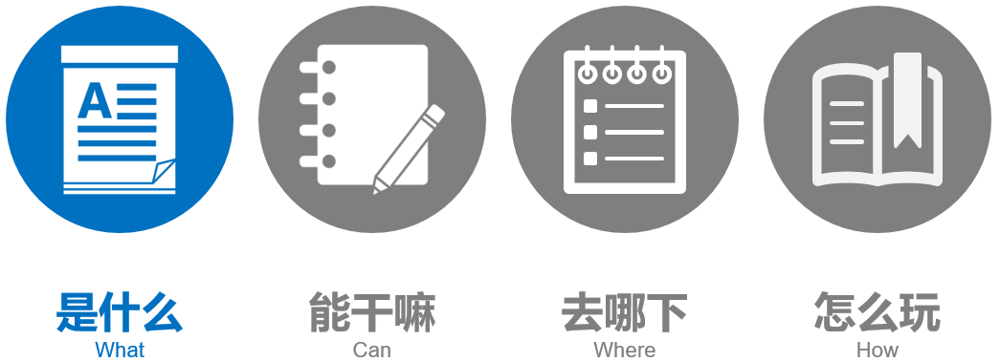


Git是目前世界上最先进的分布式版本控制系统。

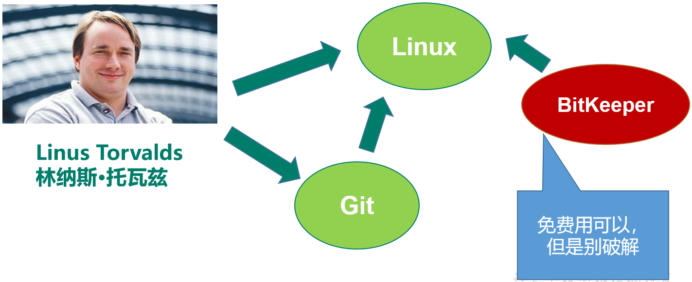


# 能干嘛

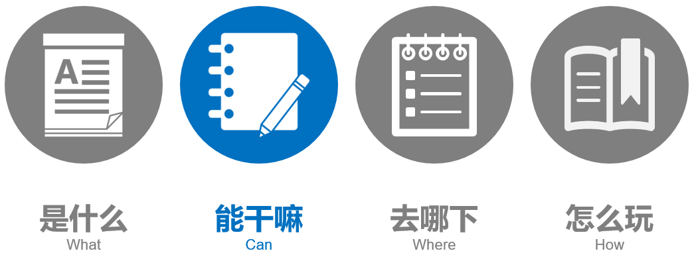


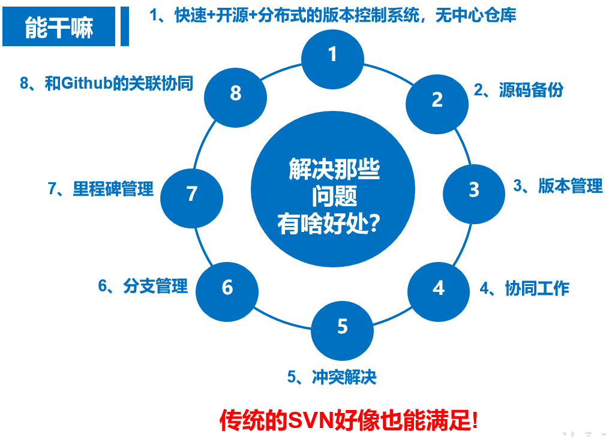


### 对比一

优点：

SVN是集中式版本控制系统，版本库是集中放在中央服务器的，而干活的时候，用的都是自己的电脑，所以首先要从中央服务器那里得到最新的版本，然后干活，干完后，需要把自己做完的活推送到中央服务器

缺点：

必须联网才能工作，如果在局域网还可以，带宽够大，速度够快，如果在互联网下，如果网速慢的话，就纳闷了

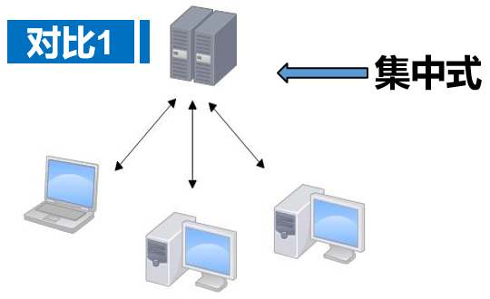

经典的集中管理型（CVS、VSS、SVN）

特点：

   实现了大部分开发中对版本管理的需求

  结构简单，上手容易。


Git是分布式版本控制系统，那么它就没有中央服务器的，每个人的电脑就是一个完整的版本库，这样，工作的时候就不需要联网了，因为版本都是在自己的电脑上。既然每个人的电脑都有一个完整的版本库，那多个人如何协作呢？比如说自己在电脑上改了文件A，其他人也在电脑上改了文件A，这时，你们两之间只需把各自的修改推送给对方，就可以互相看到对方的修改了。

### 对比二

 Git是分布式版本控制系统，那么它就没有中央服务器的，每个人的电脑就是一个完整的版本库，这样，工作的时候就不需要联网了，因为版本都是在自己的电脑上。既然每个人的电脑都有一个完整的版本库，那多个人如何协作呢？比如说自己在电脑上改了文件A，其他人也在电脑上改了文件A，这时，你们两之间只需把各自的修改推送给对方，就可以互相看到对方的修改了。

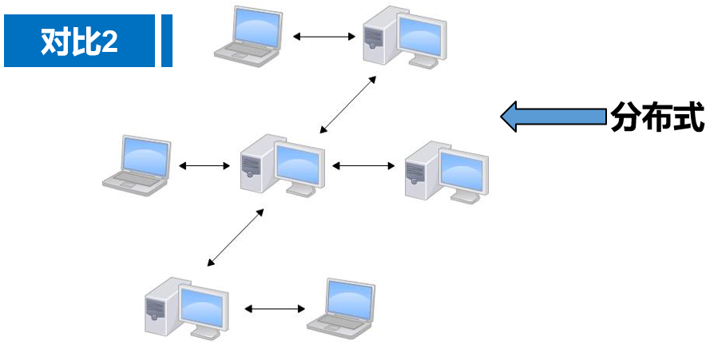

1、版本管理的服务器一旦崩溃，硬盘损坏，代码如何恢复？

2、程序员上传到服务器的代码要求是完整版本，但是程序员开发过程中想做小版本的管理，以便追溯查询，怎么破？

3、系统正在上线运行，时不时还要修改bug，要增加好几个功能要几个月，如何管理几个版本？

4、如何管理一个分布在世界各地、互不相识的大型开发团队？


•容灾能力强

•本地版本管理

•异地协作

•灵活分支

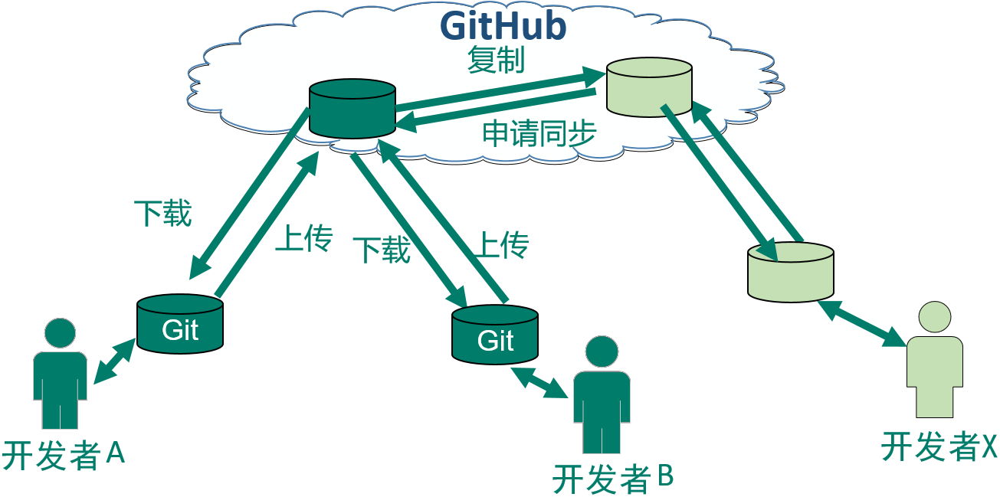


# 去哪下

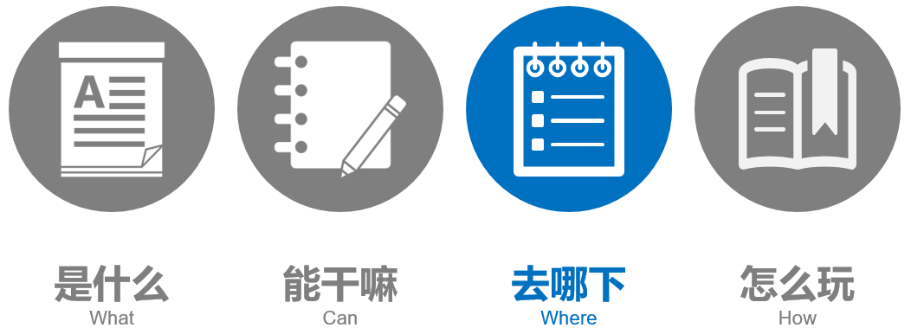


> 1、官网主页：Git for windows
>
> 下载地址：[ https://git-scm.com/](https://git-scm.com/)
>
> 
>
> 2、命令行工具：Git for windows
>
> 下载地址： https://gitforwindows.org/
>
> 
>
> 3、 IDEA插件： idea git
>
> IDEA自带，插件市场搜索最新版
>
> 
>
> 4、 GitHub网站
>
> [http://www.github.com](http://www.github.com/)


# 安装之后的设置

安装完成后，还需要最后一步设置，在命令行输入如下：

Git是分布式版本控制系统，所以需要填写用户名和邮箱作为一个标识。


--global 表示全局属性，所有的git项目都会共用属性

```
git config --global user.name “你自己的用户名"

git config --global user.email “你自己的邮箱"
```

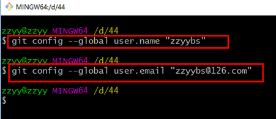


Windows系统上Git会找寻用户主目录下的.gitconfig文件。主目录即$HOME变量指定的目录

C:\Users\自己用户   目录下有个.gitconfig文件


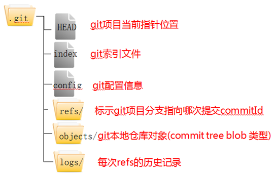


# 创建github项目的步骤

### 初始化文件夹

在一个文件夹内，执行以下命令

```
git init 
```

就可以在文件夹中生成一个隐藏的文件夹，名为.git。说明该文件夹已经是被github管理了。

### 提交文件到git库中的操作

新建一个文件，此时文件还只是在一个普通的文件夹中，并没有被github管理，此时可以用以下命令把该文件纳入github的管理系统（添加到暂存区）。

```
git add 文件名
```

管理之后，才可以进行提交的操作。只有提交之后，才代表该文件被纳入github的本地库中了。提交的命令是

```
git  commit  –m “注释内容” 文件名
```

在每一步的操作后，都可以使用以下命令查看此时github库的状态，颜色都会不一样

```
git  status
```


每次都会出现以下警告

> warning: LF will be replaced by CRLF

可以用以下命令进行屏蔽。

```
git config --global core.autocrlf false
```

 

# 版本穿梭

 

先把已存在本地库中的文件进行修改，连续修改几次。修改之后都进行add和commit操作

### 查看文件提交记录

 操作之后，可以用以下命令查看文件提交记录

```
git log 文件名
```

或者用以下命令以简易信息的模式查看

```
git log --pretty=oneline 文件名
```


### 回退到历史版本

 回退到上一次提交

```
git reset --hard HEAD^  
```

回退n次操作

```
git reset --hard HEAD~n  
```

 版本穿越

执行以下命令查看历史记录的版本号

```
 git  reflog  文件名
```

执行以下命令穿梭到对应的版本

```
  git  reset  --hard  7位版本号
```

6.还原文件

git  checkout -- 文件名  

 

### 删除文件

添加进库之前，用`rm –f 文件名`删除

添加进库之后，用`rm 文件名`删除，并且要用commit提交。

 

### 几种回退的情况

1变更，没有add，没有commit

```
git checkout --文件名
```

2变更，有add，没有commit，执行以下命令把暂存区的修改撤销掉(*unstage*),重新放回工作区

```
git reset HEAD 文件名
```

3变更，有add，有commit

```
git reset --hard HEAD^
```

 

# git的三个区

- 工作区(Working Directory):  就是你电脑本地硬盘目录
- 本地库(Repository):  工作区有个隐藏目录.git，它就是Git的本地版本库
- 暂存区(stage):  一般存放在"git目录"下的index文件（.git/index）中，所以我们把暂存区有时也叫作索引（index）。


# 分支

如下图，系统上线了，但是产品经理又提了新的需求，评估一下工期要两个月，但是同时系统正在上线运行，时不时还要修改bug，如何管理几个版本？


### 创建分支

```
git branch  <分支名>

git branch –v  查看分支
```


### 切换分支

```
git checkout  <分支名>

一步完成： git checkout  –b  <分支名>
```


### 合并分支

```
先切换到主干   git checkout master

git merge  <分支名>
```


### 删除分支

```
先切换到主干   git checkout master

git branch -D  <分支名>
```

 

# 冲突

冲突一般指同一个文件同一位置的代码，在两种版本合并时版本管理软件无法判断到底应该保留哪个版本，因此会提示该文件发生冲突，需要程序员来手工判断解决冲突。


### 合并时冲突

程序合并时发生冲突系统会提示CONFLICT关键字，命令行后缀会进入MERGING状态，表示此时是解决冲突的状态。


### 解决冲突

通过git diff 可以找到发生冲突的文件及冲突的内容。

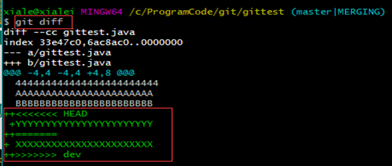

然后修改冲突文件的内容，再次`git add <file>` 和`git commit` 提交后，后缀MERGING消失，说明冲突解决完成。


# Git 常用命令小总结

   mkdir：         		                          XX (创建一个空目录 XX指目录名)
   pwd：          		                           显示当前目录的路径。
   git init         		                            把当前的目录变成可以管理的git仓库，生成隐藏.git文件。
   touch           	                               xx文件或者新建文件
   git add XX      	                            把xx文件添加到暂存区去。
   git commit –m “XX”                  	提交文件 –m 后面的是注释。
   git status        	                           查看仓库状态
   git diff  XX      	                            查看XX文件修改了那些内容
   git log          		                           查看历史记录
   git reset  --hard HEAD^	           版本回退
   cat XX         		                            查看XX文件内容
   git reflog       	                             版本穿梭，查看历史记录的版本号id
   git checkout -- XX  	                   把XX文件在工作区的修改全部撤销。
   git rm XX          	                          删除XX文件
   git remote add origin https://github.com/zzyybs/testgit 	 关联一个远程库
   git push –u(第一次要用-u 以后不需要) origin master 		     把当前master分支推送到远程库
   git clone https://github.com/arjrzhouyang/testgit  		       从远程库中克隆
   git checkout –b dev  				                                                    创建dev分支 并切换到dev分支上
   git branch  			                      查看当前所有的分支
   git checkout master 		          切换回master分支
   git merge dev    		                  在当前的分支上合并dev分支
   git branch –d dev 	               	删除dev分支
   git branch name                 		创建分支
   git remote                       			查看远程库的信息
   git remote –v 	                     	查看远程库的详细信息
   git push origin master      		Git会把master分支推送到远程库对应的远程分支上 


# Github简介与实操

### 是什么

​	GitHub是一个Git项目托管网站,主要提供基于Git的版本托管服务

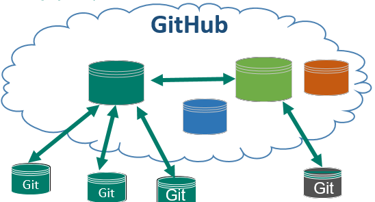

### 让本地和远程连通

##### 创建SSH Key：

```
ssh-keygen -t rsa -C 自己的邮箱
```

成功的话会在~/下生成.ssh文件夹


##### 把key粘贴到远程仓库

生成之后，把id-rsa.pub文件里的内容复制，粘贴到GitHub设置中的SSH and GPG keys中即可。然后运行以下命令测试是否可以连通

```
ssh -T git@github.com
```

连通之后，在github上新建一个仓库，建成之后会有如图片所示的提示


##### 连通

按照提示，在本地仓库中打开bash，输入给出的两行代码，就可以和GitHub进行关联了。

```
git remote add  <远端代号>   <远端地址> 
```

<远端代号>  是指远程链接的代号，一般直接用origin作代号，也可以自定义。

<远端地址>   默认远程链接的url


### 上传

把本地库的内容推送到远程git push命令，实际上是把当前分支master推送到远程

```
git push -u origin master
```

由于远程库是空的，我们第一次推送master分支时，加上了-u参数，Git不但会把本地的master分支内容推送的远程新的master分支，还会把本地的master分支和远程的master分支关联起来，在以后的推送或者拉取时就可以简化命令。

之后上传就可以通过这个命令操作了

```
git push origin master
```


##### 设置账号密码只输一次

不过有一点不舒服的就是，每次push都需要输入账户名和密码。此时可以用以下方式操作，就可以避免了。

在 “C:\用户\自己的账号” 的目录下新建名字为_netrc的文件，并编辑该文件写如下内容：

> machine github.com
> login 你自己github登陆用户名
> password 你的密码

<div style="color:#00F">蓝色</div>
另外，如果远程仓库中已经有内容的话，仓库地址可以在这个地方看到

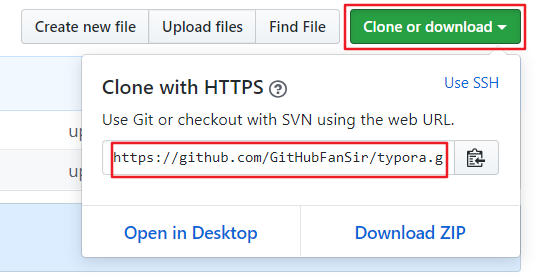

### 克隆

GitHub已经存在一个名字叫ebiz的git项目，远程库OK
用命令git clone克隆远程库到本地系统

```
git clone 仓库地址
```

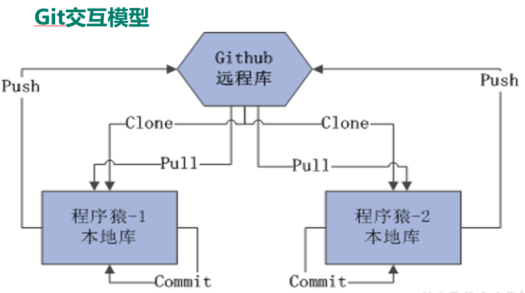


### 下载

```
git fetch origin master（先看远程仓库是否有先于自己的修改）
git pull origin master
```


### 工作流程和交互模型

1 克隆 Git 资源作为工作目录。
2 在克隆的资源上添加或修改文件。
3 如果其他人修改了，你可以更新资源。
4 在提交前查看修改。
5 提交修改。
6 在修改完成后，如果发现错误，可以撤回提交并再次修改并提交。


# Fork

把别人的项目clone一份，但是owner变成自己，这样你就可以在遵守Open source license的前提下任意修改这个项目了。

相当于你在原项目的主分支上又建立了一个分支，你可以在该分支上任意修改，如果想将你的修改合并到原项目中时，可以pull request，这样原项目的作者就可以将你修改的东西合并到原项目的主分支上去，这样你就为开源项目贡献了代码，开源项目就会在大家共同的努力下不断壮大和完善。

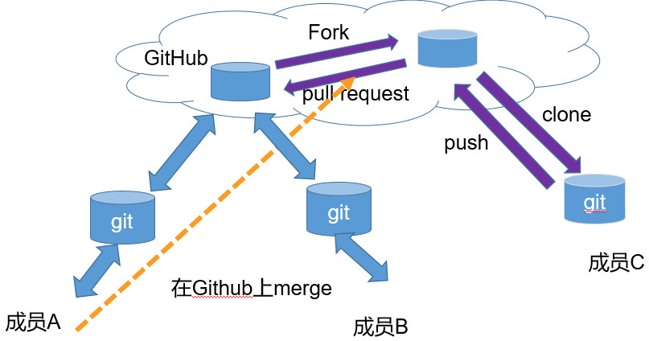


### 操作位置

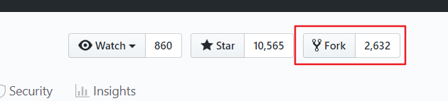


### 协作冲突

在上传或同步代码时，由于你和他人都改了同一文件的同一位置的代码，版本管理软件无法判断究竟以谁为准，就会报告冲突,需要程序员手工解决。

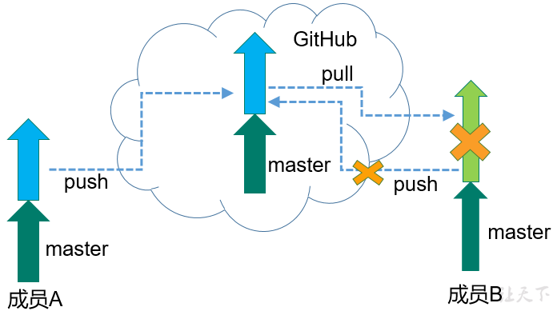


### 解决冲突

1、提交push之前，先运行git fetch origin master命令，看远程是否有先于自己本地的修改，有的话，就先把远程项目pull一份下来，把冲突的地方进行修改完毕。
2、git add 
3、git commit -m "fix conflict"

上述3步完成后再push

# github常用步骤总结

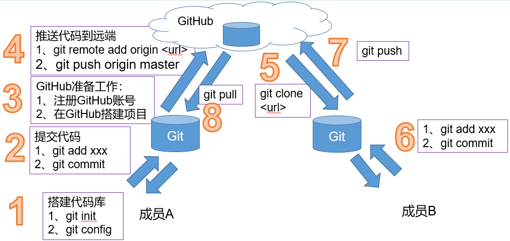


# 在IDEA中配置Git


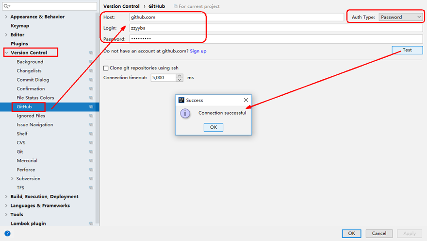

### 将github上已有的项目导入到IDEA开发工具中

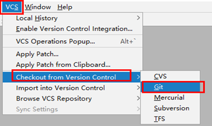

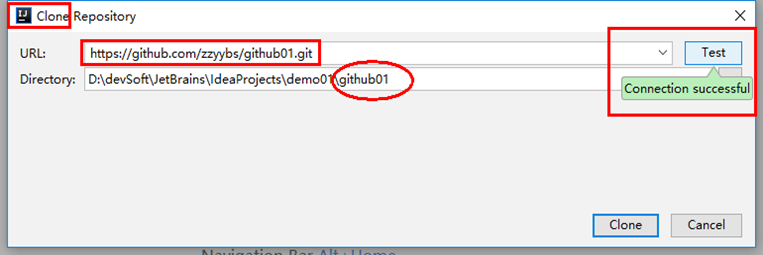

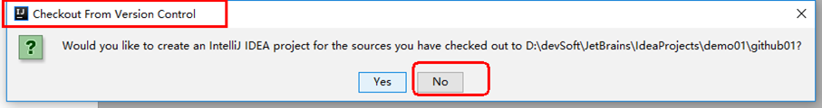

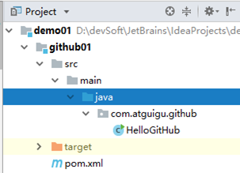


### 工作中用idea提交代码

假设一个情景，作为一个新员工，目前你IDEA工具里面已经有项目了，如何提交并进行工作协作？

(1)修改文件之前,一定要先git pull,保证修改的是最新的版本;

(2)git push之前一定要先git pull,因为可能别人修改相同的文件并已commit,应该merge过来后再一并push


在IDEA工具中先pull，保证修改的是最新的版本

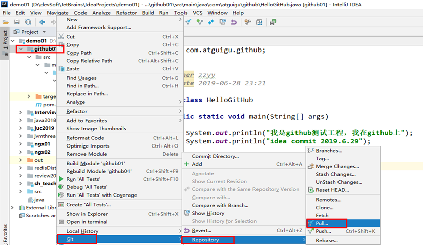


在IDEA工具中修改代码，add

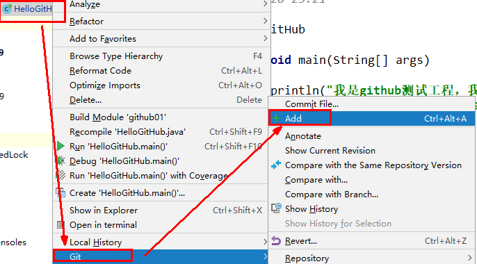


在IDEA工具中修改代码，commit

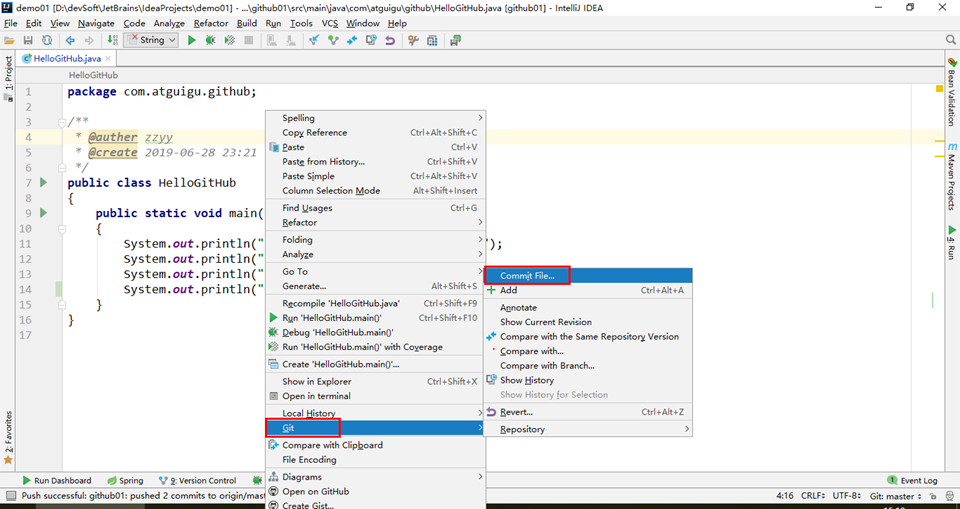


在IDEA工具中修改代码，commit并编写message

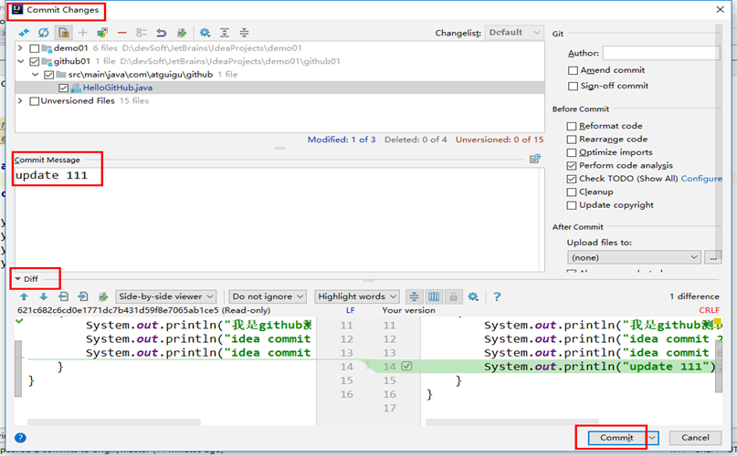


在IDEA工具中修改代码，选择pull进行更新代码操作


在IDEA工具中修改代码，push到远程Github库


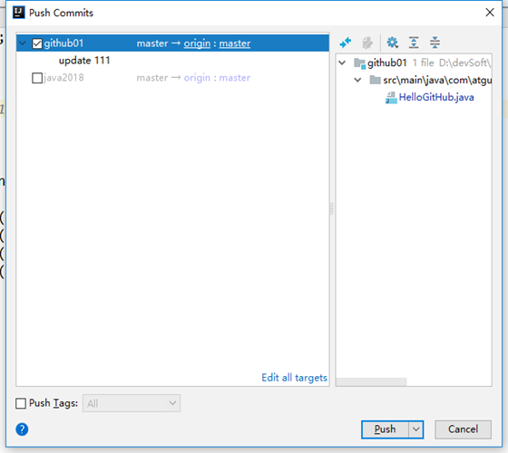


IDEA假如忘记pull（故意冲突），
某一行内容和远程仓库冲突了，没有pull，直接git add ->commit ->push


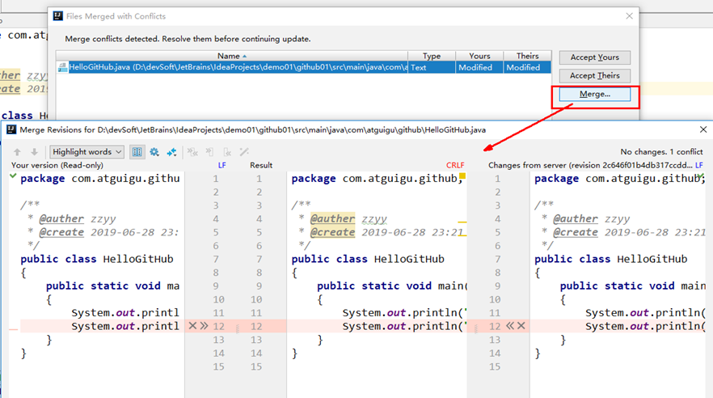

idea会提示进行冲突的解决。


### 如何用IDEA工具生成git项目并上传到远程Github

先用IDEA创建了一个普通的maven项目github02，此时它还不是一个git项目

创建本地仓库，VCS-->Import into Version Control-->Create Git Repository...

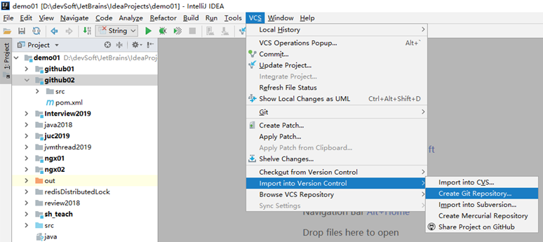


上传项目到本地仓库，项目右键选择Git-->add，
此时项目文件由红色变成绿色，此时文件只是处于暂存区，并没有真正进入到版本库中

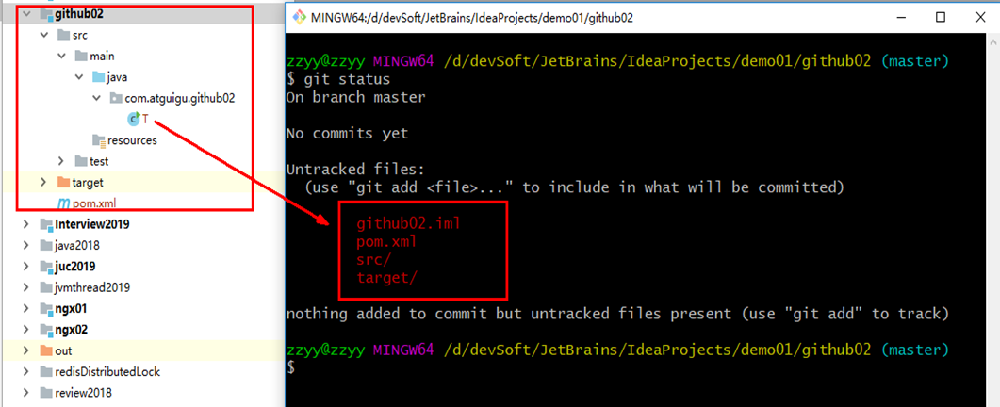

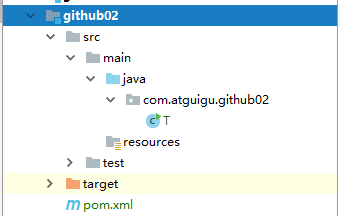


上传项目到本地仓库，项目右键选择Git-->commit。在弹窗中输入Commit Message，点击commit，此时项目文件从暂存区真正进入版本库中，项目文件变成黑色

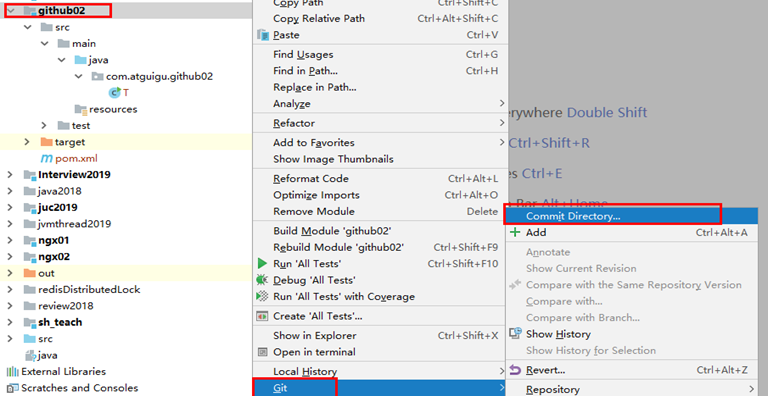


上传项目到GitHub中，
VCS-->Import into Version Control-->Share Project on GitHub

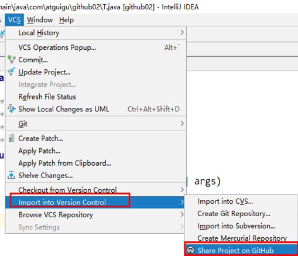

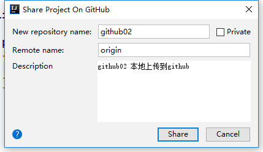


